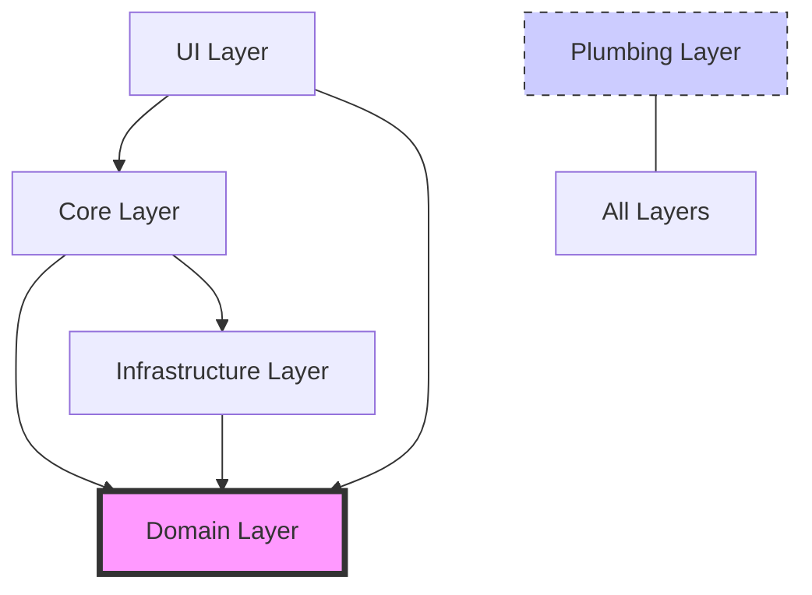

# 🏛️ Architecture: The Sovereign Hive

DietCode is engineered using the **Joy-Zoning** architectural pattern. This pattern enforces strict isolation between different levels of concern, ensuring that the AI assistant remains manageable, testable, and resilient to technical drift.

---

## 🥗 Joy-Zoning Principles

The core of Joy-Zoning is the **Horizontal Layer Isolation**. Each layer represents a "Zone" where only specific types of logic are permitted.

### 1. 📁 DOMAIN (`src/domain/`)
- **Role**: Pure Business Logic.
- **Constraints**: 
    - **Zero I/O**: No filesystem, no networks, no external SDKs.
    - **Zero External Dependencies**: Only standard TypeScript/Primitive types.
    - **High Testability**: Must be testable with zero mocks.
- **Contents**: Task models, Tool interfaces, Agent contracts, Domain errors.

### 2. 📁 CORE (`src/core/`)
- **Role**: Application Orchestration.
- **Constraints**: 
    - **Stateless Orchestration**: Coordinate between Domain and Infrastructure.
    - **No Low-Level I/O**: Use Infrastructure adapters instead.
- **Contents**: The `Orchestrator`, Service Registries, Workflow logic.

### 3. 📁 INFRASTRUCTURE (`src/infrastructure/`)
- **Role**: Concrete Implementations (The "How").
- **Constraints**: 
    - **Domain-Agnostic**: Implement the interfaces defined in Domain.
    - **Low-Level I/O**: This is where LLM SDKs (Anthropic/OpenAI), SQLite (BroccoliQ), and FS calls live.
- **Contents**: `AnthropicAdapter`, `FilesystemTool`, `BroccoliQPersistence`.

### 4. 📁 UI (`src/ui/`)
- **Role**: Presentation (VS Code Extension).
- **Constraints**: 
    - **No Logic**: Only rendering and dispatching user intentions.
- **Contents**: `SovereignWebViewProvider`, React components (in `webview-ui`).

### 5. 📁 PLUMBING (`src/utils/`)
- **Role**: Context-Free Utilities.
- **Constraints**: 
    - **Zero context**: Must be usable anywhere.
- **Contents**: String manipulation, date formatters, math helpers.

---

## 🔄 Dependency Flow

The hierarchy of dependencies is strictly one-way. A layer can only import from layers "below" it or to its "side" if defined by the protocol.

---

## 🥦 Persistence: BroccoliQ

The **Sovereign Hive** utilizes **BroccoliQ** for all persistence needs. BroccoliQ is a hardened wrapper around SQLite that provides:
- **Axiomatic Consistency**: Strict schema enforcement.
- **High Throughput**: Optimized for rapid AI context storage.
- **Sharded State**: Prevention of database locking during long-running agent tasks.

---

## 🛡️ Tool Security & Sharding

Every tool executed by the AI (e.g., `write_file`) passes through the **Sovereign Guardrail** system:
1. **Pre-check**: Domain validation of parameters.
2. **Hardening**: Infrastructure-level path resolution and safety checks.
3. **Execution**: Atomic execution with rollback capabilities provided by BroccoliQ transactions.

> [!IMPORTANT]
> **Rule 1 of the Hive**: Every file MUST start with a `[LAYER]` tag in the first line. This ensures automated linting tools can verify architectural integrity.

---

Build with Sovereignty. Build with Joy.
