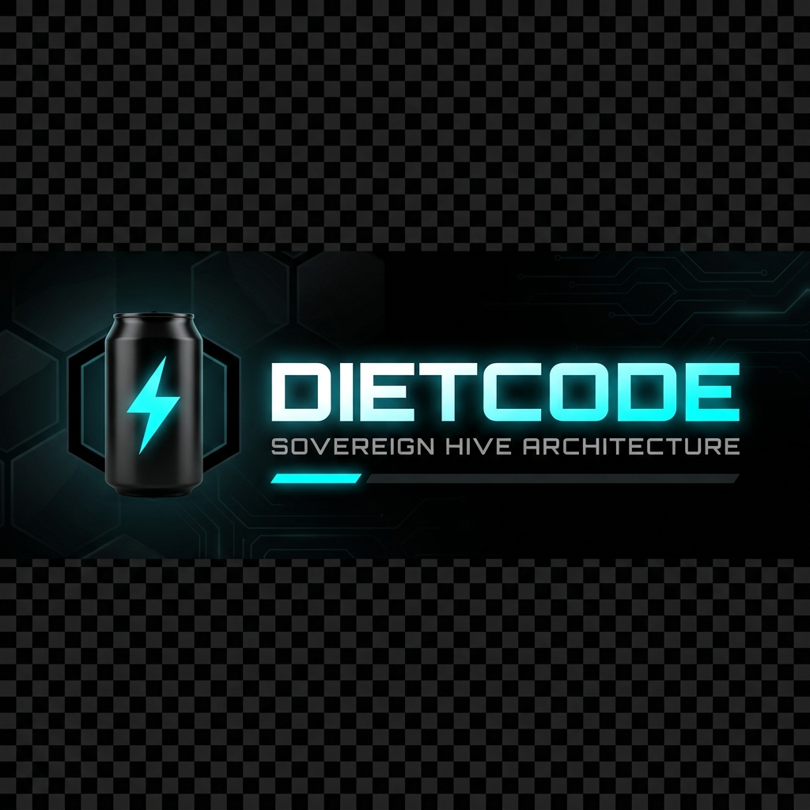

<p align="center">
  
</p>

# 🥗 DietCode: Sovereign Hive

> **"The most sharded, modular, and Level 10 hardened AI orchestration infrastructure in the ecosystem."**

**DietCode** is a minimalist, architecturally pure AI coding assistant. It is engineered with the **Sovereign Hive Architecture**, strictly adhering to **Joy-Zoning** principles to ensure zero-shim, high-throughput AI orchestration in a standalone CLI environment.

---

## 🏛️ The Sovereign Vision

DietCode isn't just a tool; it's a **Sovereign Hive**. By sharding logic into strict, isolated professional zones, we achieve:
- **Axiomatic Finality**: Every action is verified, typed, and hardened.
- **Zero-Shim Orchestration**: Direct, granular control over AI agents without bloated abstractions.
- **Cinematic CLI**: A high-fidelity, immersive terminal interface designed for peak flow.

---

## 🚀 Quick Start

### 1. Prerequisites
- [Bun](https://bun.sh) runtime (v1.2.18+)
- Google Gemini API Key (or other compatible providers)

### 2. Installation
```bash
bun install
```
> [!NOTE]
> The installation process automatically builds the CLI and links the `dietcode` command to your terminal using a `postinstall` hook.

### 3. Launching the Hive
To initiate the cinematic onboarding and establish your neural link:
```bash
dietcode
```

> [!TIP]
> If symbols are not displaying correctly in your terminal, run `dietcode --no-unicode` to enable **Axiom ASCII** compatibility mode.

---

## 📐 Joy-Zoning Architecture

DietCode follows a strict layered architecture to prevent technical drift:

- **📁 DOMAIN**: Pure business logic. The axiomatic heart.
- **📁 CORE**: Orchestration. Coordinating the Hive's pulse.
- **📁 INFRASTRUCTURE**: Concrete adapters (AI SDKs, FS, DB).
- **📁 UI**: Cinematic terminal presentation and renderers.
- **📁 PLUMBING**: Stateless, zero-context utilities.

For a deep dive, see [ARCHITECTURE.md](ARCHITECTURE.md).

---

## 📚 Documentation Map

Explore the Hive's technical layers:

| Document | Purpose |
| :--- | :--- |
|  castle [**ARCHITECTURE**](ARCHITECTURE.md) | Deep dive into Joy-Zoning and the Sovereign Hive design. |
| 🧬 [**REACTIVE STATE**](docs/architecture/REACTIVE_STATE_BACKBONE.md) | The throttled, reactive gRPC backbone of the Hive. |
| 🏛️ [**STATE MGMT**](docs/architecture/STATE_MANAGEMENT.md) | Schema definitions, orchestrators, and synchronization. |
| ⚒️ [**DEVELOPMENT**](DEVELOPMENT.md) | Guide for contributors, build scripts, and testing protocols. |
| ✨ [**FEATURES**](FEATURES.md) | Cinematic Boot, Dreamstate UI, and Hardened Guardrails. |
| 🤝 [**CONTRIBUTING**](CONTRIBUTING.md) | The Level 10 Standard for adding to the Hive. |
| 🚨 [**TROUBLESHOOTING**](docs/TROUBLESHOOTING.md) | Common issues and configuration fixes. |

---

## 🛠️ Built-in Tools
- **Sovereign CLI**: Zero-command, hyper-automated terminal interface.
- **Deep Filesystem**: Hardened `read`/`write`/`grep` with safety sharding.
- **BroccoliQ Persistence**: Highly-available, sharded SQLite state management.
- **Dreamstate Boot**: Immersive, multi-phase cinematic diagnostics.

---

Built with 🥗 by **CardSorting**.
