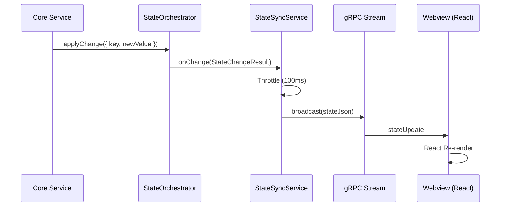

# 🧬 Reactive State Backbone

The DietCode architecture utilizes a **Unified Reactive Backbone** for state synchronization between the extension host (backend) and the webview (frontend). This pattern ensures that the UI is always a consistent reflection of the backend's internal state without the need for manual polling or complex event-driven updates.

## Core Concepts

### 1. Single Stream Synchronization
Instead of multiple gRPC subscriptions for different data types (MCP, history, execution), the system uses a single `subscribeToState` stream. This stream broadcasts the entire orchestrated state whenever a relevant change occurs.

### 2. State Orchestration
The `StateOrchestrator` acts as the single source of truth for all mutable state in the extension. It manages:
- **Validation**: Ensuring state changes follow business rules.
- **Sanitization**: Cleaning data before it hits persistence.
- **Debounced Persistence**: Efficiently saving state to the `VsCodeStateRepository`.
- **Global Observation**: Notifying services of any changes across the entire state tree.

### 3. Throttled Broadcasting
To prevent UI flooding during high-frequency updates (e.g., rapid tool execution sequences), the `StateSyncService` implements a **100ms throttle**. This ensures that the UI remains responsive and smooth by batching intermediate state transitions.

## Data Flow

## Implementation Details

- **Global Observer**: Services register as observers via `StateOrchestrator.getInstance().registerGlobalObserver()`.
- **State Snapshotting**: The `getStateSnapshot()` method allows new webview instances to instantly hydrate with the complete "True" state of the backend.
- **Dynamic Assembly**: The `SovereignWebViewProvider` dynamically merges orchestrated state with static settings and provider health status to create the final `ExtensionState` object sent to the UI.

## Benefits
- **Zero Drift**: The UI and Backend never disagree on state.
- **Simplicity**: Adding new reactive features only requires adding a key to the state schema.
- **Efficiency**: Reduces network overhead by eliminating redundant polling requests.
